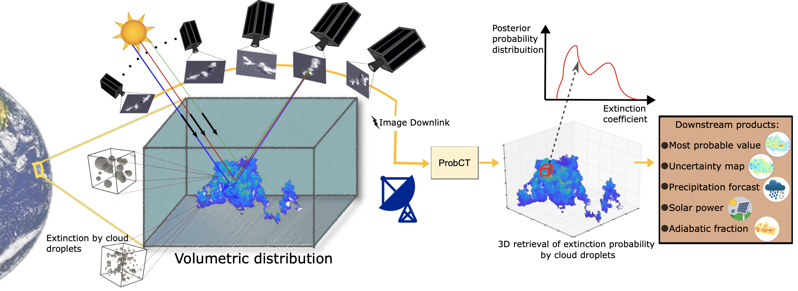
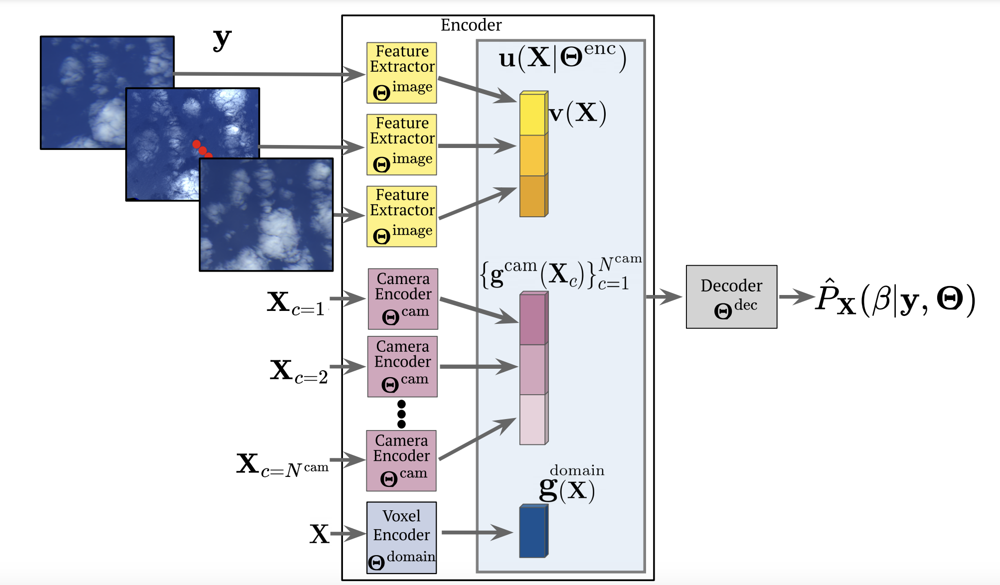
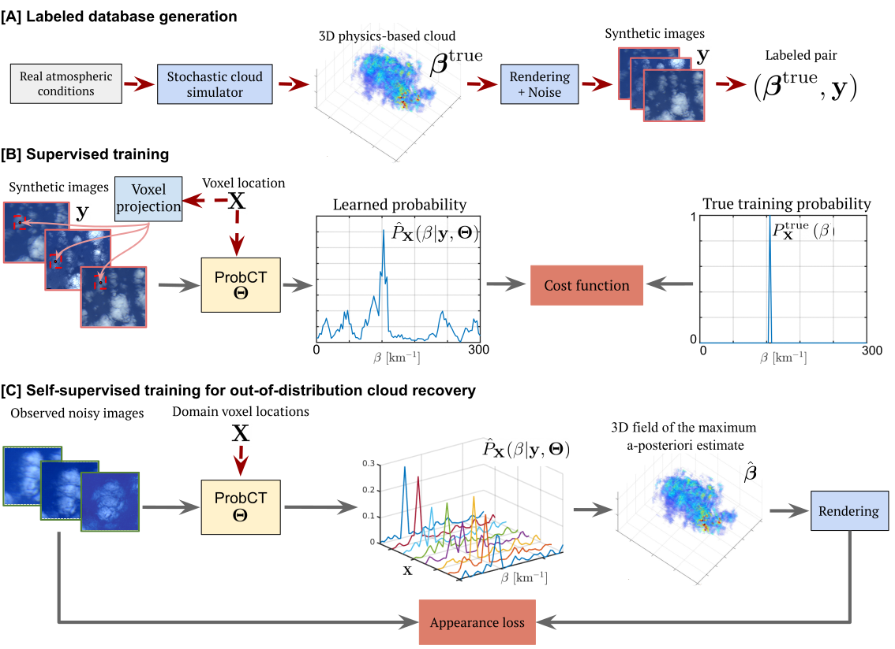

# Learned 3D volumetric recovery of clouds and its uncertainty


## Abstract
Significant uncertainty in climate prediction and cloud physics is tied to observational gaps relating to shallow scattered clouds. 
Addressing these challenges requires remote sensing of their three-dimensional (3D) heterogeneous volumetric scattering content.
This calls for passive scattering computed tomography (CT).
We design a learning-based model (ProbCT) to achieve CT of such clouds, based on noisy multi-view spaceborne images.
ProbCT infers  – for the first time – the posterior probability distribution of the heterogeneous extinction coefficient, per 3D location.
This yields arbitrary valuable statistics, e.g., the 3D field of the most probable extinction and its uncertainty. 
ProbCT uses a neural-field representation, making essentially real-time inference. 
ProbCT undergoes supervised training by a new labeled multi-class database of physics-based volumetric fields of clouds and their corresponding images. We publish this database with the paper. To improve out-of-distribution inference, we incorporate self-supervised learning through differential rendering.
We demonstrate the approach in simulations and on real-world data, and indicate the relevance of 3D recovery and uncertainty to precipitation and renewable energy. 




## Description
This repository contains the official implementation of ProbCT model.




&nbsp;


## Installation 
Installation using using anaconda package management

Start a clean virtual environment
```
conda create -n probct python=3.8
conda activate probct
```

Install required packages
```
cd LearnedCloudCT
pip install -r requirements.txt
pip install -e .
git clone https://github.com/ronenroi/pyshdom4VIP-CT.git
cd pyshdom4VIP-CT
python setup.py develop
```


&nbsp;
Generate Mie tables for phase function and albedo computations
```
python scripts/generate_mie_tables.py  \
    --start_reff 1.0 --end_reff 65.0 --num_reff 117 --start_veff 0.01 --end_veff 0.4 --num_veff 117 \
    --radius_cutoff 100.0 --wavelength  0.66 0.672
```

&nbsp;
Return to project directory and create data directory:
```
cd ../
mkdir data
```
&nbsp;
You can also train the model using different RT engine:
* The treatment of legacy Fortran code has changed from GCC 9.X to 10.X+ so currently there is a flag in the setup.py script which needs to be commented if trying to install using GCC 9.X or earlier versions.
The flag is `extra_f77_compile_args=["-fallow-argument-mismatch"]`
```
git clone https://github.com/CloudTomography/AT3D.git
cd AT3D
pip install "pandas<2.0.0"
pip install nose2
pip install xarray
pip install netcdf4
pip install bottleneck
pip install -e .
cd ../
```

## Usage

## Description
ProbCT pipeline is composed of three stages:

[A] Data generation - A physics-based cloud simulator generates a random 3D cloud fields. Then, the scene is physically
rendered to yield corresponding multi-view images.

[B] Supervised volumetric training of ProbCT using pairs of labeled data, estimating the posterior probability
distribution, per 3D location X. 

[C] Self-supervised training, improving inference of out-of-distribution clouds. 




&nbsp;
### [A] Data

We used cloud field data that was generated by Eshkol Eytan (see citation below).
You can download the simulated cloud data and real-world AirMSPI files [here](https://technionmail-my.sharepoint.com/:f:/g/personal/roironen_campus_technion_ac_il/EqKyFij1vp9AktzBZ_9gHpgBzdLVnAUDPJz9Df_4X7UAXQ?e=KnkmtR).
Place the datasets in the data directory.

Generating new cloud images, can be done by running the scripts in 
```
LearnedCloudCT/pyshdom4VIP-CT/VIP-CT_scripts
```
#### Trained ProbCT models will be published upon peer-reviewed publication.

&nbsp;
### [B] Supervised training 
Set the config file at `configs/train.yaml` according to the desired experiment, e.g. dataset_name: 'CASS_600CCN_roiprocess_10cameras_20m' / 'BOMEX_50CCN_10cameras_20m' etc.

For training ProbCT model with AirMSPI imaging geometry, change `configs/train.yaml` accordingly.

Then, run

```
python scripts/train_ProbCT.py
```
### [C] Self-supervised training for image consistency
Set the config file at `configs/ft_train.yaml` according to the desired experiment, e.g. pre-trained model path.

Self-supervised training of ProbCT model on real-world AirMSPI images can be done by setting `configs/ft_train.yaml` with "AirMSPI_32N123W_experiment_234_clouds" dataset.

Then, run (this script requires both strong GPU and CPU cores)

```
python scripts/ft_train_ProbCT.py
```

For using the AT3D RT engine change in `configs/ft_train.yaml` the renderer type from `shdom` to `at3d`.


### Evaluation 
Set the config file at `configs/test.yaml` according to the desired experiment and the path of ProbCT trained model.
Then, run

```
python scripts/test_ProbCT.py
```

For inference on AirMSPI test images, set the model path in `configs/test_airmspi.yaml`, and run

```
python scripts/test_ProbCT_AirMSPI.py
```
or via this Jupyter notebook 
```
notebooks/AirMSPI_results.ipynb
```
This notebook also demonstrates downstream products of this experiment.  
&nbsp;

If you use this package in an academic publication please acknowledge the appropriate publications (see LICENSE file). 

